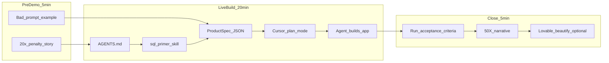

# SQL Primer SDD Demo Plan

## Demo concept

Build **SQL Primer** — a lightweight SQL playground where users write `SELECT` queries against seeded sample tables and see results instantly.

**Tech stack chosen for Lovable compatibility** (Lovable's native output stack):

| Layer | Technology | Why |
|-------|------------|-----|
| Framework | React 18 + TypeScript | Lovable default |
| Build | Vite | Lovable default |
| Styling | Tailwind CSS only | No custom CSS files — Lovable can't easily restyle bespoke CSS |
| UI | shadcn/ui (`src/components/ui/`) | Lovable's component library; beautify = swap variants, add Card/Tabs/Table |
| Routing | React Router | Lovable default (`src/pages/`) |
| Data | Supabase (PostgreSQL) | Lovable's backend; seeded tables + read-only RPC for raw SQL |

**Lovable handoff note:** Lovable [cannot import an existing GitHub repo](https://docs.lovable.dev/integrations/github) — it only exports *to* GitHub. Handoff workflow: build in Cursor using Lovable's exact stack → push to GitHub → create a Lovable project with GitHub sync → replace generated files with your repo (keeping `.git`) → use Lovable chat to beautify UI. Because we match its stack, Lovable understands every file.

This app is a strong SDD teaching vehicle because:
- The **spec is concrete** (tables, columns, acceptance criteria are testable)
- A **sql-primer skill** gives the agent domain guardrails (naming, seed order, read-only safety)
- The **before/after** is obvious: vague prompt → broken UI vs spec → working playground in one session
- **Phase 2 story:** "Cursor + spec built the logic in 20 minutes; Lovable polished the UI in 10" — a second throughput multiplier for the audience



---

## Recommended 30-minute run-of-show

| Time | Segment | What you do | Artifact |
|------|---------|-------------|----------|
| 0–4 min | **The problem** | Show how cross-system work has a **20x velocity penalty** ([`Technical_specification.md` §1.3](c:\Sites\claude-sdd-test\Technical_specification.md)). Contrast a bad prompt ("make me a SQL app") vs a structured spec. | Slide or browser tab with bad prompt |
| 4–7 min | **AGENTS.md** | Create [`AGENTS.md`](AGENTS.md) live: project purpose, stack, "read skills before coding", verification rule. Explain this is persistent agent memory — lighter than rules, broader than one skill. | `AGENTS.md` |
| 7–9 min | **Cursor skills** | Create [`.cursor/skills/sql-primer/SKILL.md`](.cursor/skills/sql-primer/SKILL.md). Show how skills encode **persona + constraints** (borrow patterns from [`sql-ops/SKILL.md`](c:\Sites\SDD_Ghostwheel\.cursor\skills\sql-ops\SKILL.md): Hub-first seeding, snake_case, read-only queries). Invoke skill in chat: *"Use the sql-primer skill."* | Skill file |
| 9–12 min | **The spec** | Write or paste [`specs/sql-primer-product-spec.json`](specs/sql-primer-product-spec.json). Walk through **scope, nonGoals, constraints, acceptanceCriteria** — the four fields that prevent agent drift. Reuse the ProductSpec shape from your existing work ([`membership-commerce-demo.json`](c:\Sites\claude-sdd-test\orchestration\product-specs\2026-02-27T-membership-commerce-demo.json)). | ProductSpec JSON |
| 12–14 min | **Plan mode** | Ask Cursor to create an implementation plan from the spec (Plan mode). Show the DAG-style task breakdown — this is the bridge between spec and code. | `.cursor/plans/*.plan.md` |
| 14–15 min | **Yolo mode** | Briefly show Cursor Settings → Agent → **Auto-run** (formerly "Yolo mode"). Explain why you enable it for live builds (see section below). Show your allow/deny list. | Settings screen |
| 15–26 min | **Live build** | Switch to Agent mode with auto-run on. Prompt: *"Implement the SQL Primer plan. Follow AGENTS.md and sql-primer skill. Verify each acceptance criterion."* Narrate while the agent runs `npm install`, `tsc`, `npm run dev` without stopping for approval. | Working app |
| 26–28 min | **50X close** | Run acceptance criteria checklist live. Tell the throughput story (below). | Demo + narrative |
| 28–30 min | **Lovable beat** (optional) | Show pre-recorded or live Lovable prompt: *"Make the SQL Primer UI polished — dark sidebar schema browser, shadcn Card layout, monospace editor."* Emphasize: same stack = zero rewrite. | Beautified UI |

---

## App scope (intentionally narrow for live build)

### In scope (MVP)
- **Supabase PostgreSQL** with pre-seeded tables (migration run before demo — not live)
- Read-only query execution via Supabase RPC `run_readonly_query(sql text)` (validates SELECT-only server-side)
- **4 seeded tables** with membership-flavored sample data (ties to your domain without GhostWheel complexity):

| Table | Purpose |
|-------|---------|
| `members` | `id`, `email`, `full_name`, `joined_at` |
| `memberships` | `id`, `member_id`, `plan_name`, `status`, `expires_at` |
| `products` | `id`, `name`, `price_cents`, `is_member_only` |
| `orders` | `id`, `member_id`, `product_id`, `ordered_at`, `total_cents` |

- Query editor (`shadcn/ui` Textarea or Code-style input) + **Run** Button
- Results rendered with `shadcn/ui` Table component (columns + rows + row count footer)
- **SELECT-only** enforcement client-side AND in Postgres RPC (reject mutating statements)
- 3 starter example queries (`shadcn/ui` Badge chips or sidebar links)
- Functional UI only during live build — polish deferred to Lovable (intentional)

### Non-goals (say these aloud during spec writing)
- No custom CSS files — Tailwind utility classes only (Lovable constraint)
- No auth / user accounts (Supabase anon key + RLS on RPC only)
- No multi-statement scripts, no DDL from the editor
- No pixel-perfect design during Cursor build — Lovable owns beautification
- No production hardening

### Acceptance criteria (copy into ProductSpec)
1. App loads with schema browser showing all 4 tables and column names
2. `SELECT * FROM members LIMIT 5` returns 5 rows in &lt; 2 seconds
3. A JOIN query across `members` + `memberships` returns correct rows
4. `DROP TABLE members` shows a friendly error, schema unchanged
5. Example query chips populate the editor and run successfully

---

## Repository structure (Lovable-compatible layout)

Match Lovable's generated structure so handoff is copy-paste, not rewrite:

```
sdddemo/
├── AGENTS.md
├── specs/
│   └── sql-primer-product-spec.json
├── docs/
│   └── PRESENTER_NOTES.md
├── .cursor/skills/sql-primer/SKILL.md
├── supabase/
│   ├── migrations/
│   │   ├── 001_create_tables.sql      # PRE-DEPLOYED before demo
│   │   ├── 002_seed_data.sql
│   │   └── 003_run_readonly_query.sql # RPC function
│   └── config.toml
├── .env.example                       # VITE_SUPABASE_URL, VITE_SUPABASE_ANON_KEY
├── components.json                    # shadcn config (Lovable uses this)
├── tailwind.config.ts
├── index.html
├── package.json
├── vite.config.ts
├── src/
│   ├── main.tsx
│   ├── App.tsx
│   ├── index.css                      # Tailwind directives only
│   ├── pages/
│   │   └── Index.tsx                  # Main playground page (Lovable pattern)
│   ├── components/
│   │   ├── ui/                        # shadcn primitives (Button, Table, Card, Textarea, Badge)
│   │   ├── QueryEditor.tsx
│   │   ├── ResultsTable.tsx
│   │   └── SchemaBrowser.tsx
│   ├── integrations/
│   │   └── supabase/
│   │       ├── client.ts              # Lovable convention
│   │       └── types.ts               # Generated DB types
│   ├── hooks/
│   │   └── useRunQuery.ts
│   └── lib/
│       ├── utils.ts                   # cn() helper — shadcn standard
│       └── queryGuard.ts              # Client-side SELECT-only check
└── README.md
```

### Pre-demo Supabase setup (not shown live — 15 min before presentation)

Run once; agent references but does not create during the 30-min window:

```sql
-- 003_run_readonly_query.sql (sketch)
CREATE OR REPLACE FUNCTION run_readonly_query(query text)
RETURNS jsonb LANGUAGE plpgsql SECURITY DEFINER AS $$
BEGIN
  IF query !~* '^\s*SELECT' OR query ~* '\b(INSERT|UPDATE|DELETE|DROP|ALTER|CREATE|TRUNCATE)\b' THEN
    RAISE EXCEPTION 'Only SELECT queries are allowed';
  END IF;
  RETURN (SELECT jsonb_agg(row_to_json(t)) FROM (EXECUTE query) t);
END; $$;
```

Grant `EXECUTE` to `anon` via RLS policy on the function.

---

## Key artifacts to pre-write (before demo day)

These reduce live-build risk without spoiling the SDD story:

### 1. [`docs/PRESENTER_NOTES.md`](docs/PRESENTER_NOTES.md)
- Full run-of-show with timestamps
- Bad-prompt example to paste
- Acceptance criteria checklist
- Fallback if live build stalls at 20 min: "we already have seed data and components spec'd — agent finishes the wiring"

### 2. [`specs/sql-primer-product-spec.json`](specs/sql-primer-product-spec.json) (draft)
Pre-draft the spec so you can **paste and edit one field live** (e.g., add a constraint) rather than type JSON from scratch. Use the same schema as your existing ProductSpecs:

```json
{
  "id": "spec-sql-primer-001",
  "name": "SQL Primer Playground",
  "summary": "Browser-based SQL playground with seeded membership sample data for learning SELECT, JOIN, and aggregation.",
  "scope": ["..."],
  "nonGoals": ["..."],
  "constraints": ["Vite + React + TypeScript + Tailwind + shadcn/ui", "Supabase PostgreSQL", "Lovable-compatible layout", "SELECT only"],
  "acceptanceCriteria": ["..."]
}
```

### 3. Skill skeleton [`.cursor/skills/sql-primer/SKILL.md`](.cursor/skills/sql-primer/SKILL.md)
Pre-write ~40 lines; **add one rule live** during the demo (e.g., "always show row count in results footer"). Skill should cover:
- When to use (SQL primer / playground work)
- Table naming (`snake_case`)
- Seed data realism (5 members, varied membership statuses)
- SELECT-only guard implementation pattern
- Verification commands (`npm run dev`, manual AC checklist)

### 4. [`AGENTS.md`](AGENTS.md) skeleton
~30 lines:

```markdown
# SQL Primer — Agent Instructions

## Purpose
Browser SQL playground for learning queries against sample membership data.

## Stack (Lovable-compatible)
Vite, React, TypeScript, Tailwind CSS, shadcn/ui, React Router, Supabase.
No custom CSS files. UI components live in `src/components/ui/`.

## Workflow
1. Read `specs/sql-primer-product-spec.json` before implementing
2. Read `.cursor/skills/sql-primer/SKILL.md` before writing SQL or DB code
3. Use Plan mode for multi-file features; Agent mode for execution
4. Verify all acceptance criteria before claiming done

## Conventions
- Functional React components; Tailwind utilities only (no .css modules)
- shadcn/ui for all interactive elements (Button, Table, Card, Textarea)
- Supabase client at `src/integrations/supabase/client.ts`
- snake_case SQL identifiers
- Never allow mutating SQL statements
```

---

## Lovable beautification handoff

### Why this stack matters
Lovable generates **React + Vite + Tailwind + shadcn/ui + Supabase**. If Cursor builds with the same stack, Lovable can:
- Restyle components without fighting alien patterns
- Add layout polish (sidebars, responsive grids, dark mode) via chat
- Extend with Supabase-aware features it already understands

### Handoff steps (post-demo or pre-recorded clip)
1. Push `sdddemo` to a GitHub repo
2. In Lovable: create new project → Connect GitHub → let it create the repo
3. Replace Lovable's generated `src/` with yours (keep `components.json`, Tailwind config, `.git`)
4. Add `.env` with Supabase keys in Lovable project settings
5. Prompt Lovable: *"Polish the SQL Primer playground: split-pane layout, schema browser in a Card sidebar, monospace query editor, results in a scrollable Table with row count."*

### Demo talking point
*"Spec-driven dev in Cursor gives us correctness and speed. Lovable gives us design velocity on the same codebase — no throwaway prototype."*

---

## Teaching moments to hit explicitly

### AGENTS.md vs skills vs rules
| Mechanism | Role in demo |
|-----------|--------------|
| **AGENTS.md** | Project-wide "how we work here" — always loaded context |
| **Skills** | Deep domain expertise on demand — `sql-primer` for DB/UI patterns |
| **Rules** (`.cursor/rules/*.mdc`) | Optional mention: file-specific lint-style guardrails; skip creating live unless time permits |

### Value of a good spec
Show **one field** that saves the agent: `nonGoals`. Example: without "no backend," the agent might scaffold Express + Postgres and blow the 12-minute build window. `acceptanceCriteria` become your demo exit checklist.

### Yolo mode (Auto-run)

**What it is:** Yolo mode is Cursor's informal name for **Auto-run** — a setting in **Cursor Settings → Agent → Auto-run** that lets the agent execute terminal commands without asking you to click "Allow" on every one.

Without it, a live build feels broken: the agent writes code, wants to run `npm install`… waits. Wants `tsc`… waits. Wants `npm run dev`… waits. Ten approvals for one feature. Your audience watches you click instead of watching the agent work.

With it, the agent can **iterate autonomously**: install deps → typecheck → fix errors → run dev server → verify acceptance criteria — the full **Plan → Execute → Verify** loop without babysitting.

**How to enable:** `Ctrl+Shift+J` (Windows) → Agent section → toggle **Auto-run** on. Configure via:
- **Allow list** — commands the agent may run without asking (prefix matching: `npm` allows all npm commands)
- **Deny list** — takes priority over allow; block destructive commands
- **Natural-language prompt** — describe what's safe ("tests, builds, linting, and package installs are fine")

**Recommended allow list for this demo:**
```
npm install, npm run, npx, tsc, vite, eslint, prettier
mkdir, touch, cp, mv
git status, git diff, git log
```

**Recommended deny list:**
```
rm -rf, git reset --hard, git push --force, git commit
```

**Why it fits the SDD story:** Spec + skills tell the agent *what* to build. Yolo mode removes the friction of *executing* the build loop. Together they are what make "working app in 12 minutes" credible on stage — the agent isn't waiting on you between every tool call.

**Safety framing for your coworker:** Yolo is not reckless automation — it's **delegated execution with guardrails**. The spec is the contract, the deny list is the safety net, and you still review the diff at the end. Contrast with actually reckless prompting: *"fix everything, I don't care how"* with no spec and an empty deny list.

**Demo beat (1 min):** Show the settings screen, then say: *"I'm turning this on because I trust the spec and my allow list more than I trust clicking Allow fifteen times during a demo."*

### 50X throughput narrative (honest framing)
Don't claim magic — use a credible stack:

1. **Baseline:** "Add a query UI with seeded tables, schema browser, and safety guard" = 1–2 dev-days traditionally (scaffold, seed script, UI, edge cases)
2. **Structural penalty:** Your architecture doc cites **20x** on cross-system changes; even a single-system feature loses hours to ambiguity and rework
3. **SDD multiplier:** Spec eliminates ambiguity (~2–3x), skills eliminate convention drift (~2x), agent execution eliminates boilerplate (~3–5x)
4. **Yolo multiplier:** Auto-run removes approval friction during the verify loop — the agent can run 20+ commands in one session instead of stopping after each
5. **Combined story:** "Afternoon with spec + agents vs. a sprint without" — **10–50x depending on scope**; for this 4-table playground, **~20x is defensible**

Anchor line: *"We're not 50x faster at thinking. We're 50x faster at the part machines are good at — once we've done the thinking in the spec."*

---

## Live-build prompt (copy-paste ready)

Use after Plan mode produces a plan:

```
Implement the SQL Primer playground per specs/sql-primer-product-spec.json.

REQUIRED:
- Read AGENTS.md
- Read and follow .cursor/skills/sql-primer/SKILL.md
- Lovable-compatible stack: Vite + React + TypeScript + Tailwind + shadcn/ui + React Router
- Supabase client at src/integrations/supabase/client.ts (tables already seeded — do NOT recreate migrations)
- Call run_readonly_query RPC for query execution; client-side SELECT guard as backup
- shadcn components: Button, Textarea, Table, Card, Badge for example query chips
- Schema browser + query editor + results table + 3 example queries
- Functional UI only — no custom CSS files, Tailwind utilities only

When done, run npm run dev and verify every acceptance criterion in the spec.
```

---

## Risk mitigation for live build

| Risk | Mitigation |
|------|------------|
| Supabase env vars missing | Pre-create `.env.local`; verify `npm run dev` works morning-of |
| Agent tries to rebuild DB | Spec + skill say migrations are pre-deployed; agent wires client only |
| Agent adds custom CSS | AGENTS.md + spec forbid it; Lovable owns polish |
| Agent over-scopes | `nonGoals` forbid auth, custom backend, pixel-perfect design |
| Build runs long | Pre-init shadcn + Vite scaffold; live build is wiring + components only |
| Query guard missed | Acceptance criterion #4 is your safety demo moment |
| Lovable import confusion | Clarify live: Lovable exports to GitHub, not imports — we match its output format |
| Yolo runs destructive command | Pre-configure deny list (`rm -rf`, `git reset --hard`, `git push --force`); demo in a throwaway folder |
| Audience thinks Yolo is unsafe | Frame as allow/deny list + spec contract; you review diff at end |

---

## Optional stretch (only if ahead of schedule)

- Add a 5th exercise: "Write a query: members with expired memberships"
- Live Lovable beautify pass (2-min prompt: dark mode + split pane)
- Show **subagent dispatch** ("use subagent-driven-development") for one component
- Open [`SDD_Ghostwheel`](c:\Sites\SDD_Ghostwheel) sql-ops skill side-by-side: "same pattern, enterprise scale"

---

## What we will NOT do in this demo

- Build the full GhostWheel membership platform (wrong scope for 30 min)
- Run Mastra orchestrator live (mention as "next level")
- Create git commits unless you ask (per your workflow preferences)
